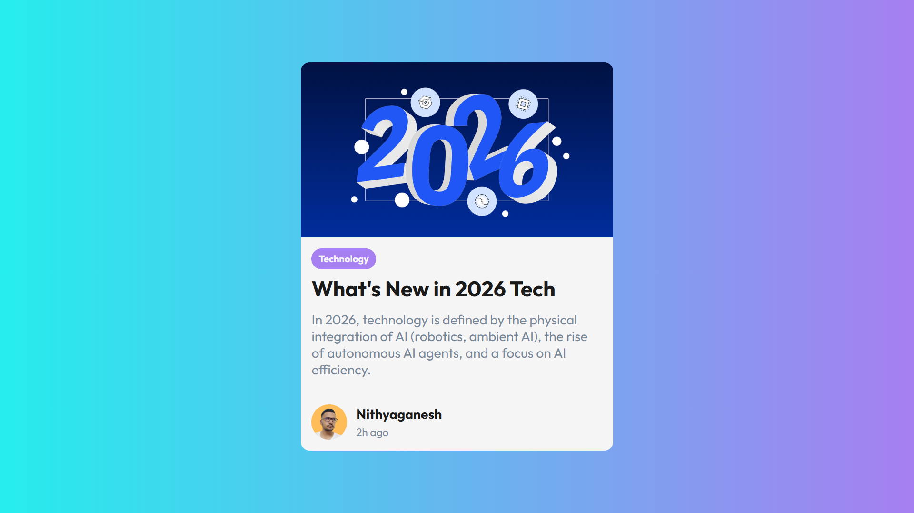

# Blog Card Component 🚀

 

A modern, responsive card UI component built using pure HTML and CSS. This project focuses on clean design, gradient backgrounds, and proper CSS layout techniques.

## 📸 Output

## 🛠️ Tech Stack

* **HTML5**: For structure and semantic markup.
* **CSS3**: For styling, including:
    * Linear Gradients (backgrounds and text).
    * Flexbox (for alignment and layout).
    * Box Model (padding, margin, border-radius).

## 📚 About the Project

This project was created as part of my learning journey in frontend development. The goal was to replicate a modern UI design with a focus on spacing, typography, and visual hierarchy.

**Key Learnings:**
* How to center a `div` perfectly using Flexbox.
* Styling rounded corners and shadows for a "card" effect.
* Embedding images and handling text alignment.

## 🙌 Credits & Acknowledgements

This project was built while learning from the **"Complete Web Development Course"** on Udemy.

A huge thanks to my instructor, **Hitesh Choudhary**, for being an awesome teacher and explaining complex tech concepts in such a simple and enjoyable way.

## 💻 How to Run

1.  Clone this repository.
2.  Open the `index.html` file in any web browser.
3.  Enjoy!

---
*Created with ❤️ by Nithyaganesh*
